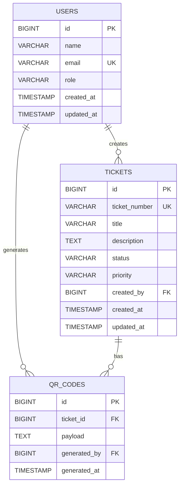

# Ticket QR Code Generator Worker — Database ERD

**Ticket:** ENG-139055  
**Epic:** Core Infrastructure Overhaul  
**Priority:** P1  
**Document Type:** Database Architecture / Capstone 1  
**Implementation Status:** Design only

---

## 1. Purpose

This document defines the proposed relational database schema for the Ticket QR Code Generator Worker.

The current deliverable is limited to **database architecture planning**. No database migrations, application code, or API implementation are included in this phase.

The schema is intentionally small and focused on the core domain:

- Staff users
- Tickets
- Generated QR-code records

---

## 2. Entity Relationship Diagram



---

## 3. Tables

### 3.1 USERS

Stores staff members who interact with the Ticket QR Code Generator Worker.

| Column | Type | Null | Key / Constraint | Description |
|---|---|---|---|---|
| `id` | BIGINT | No | PK | Unique user identifier |
| `name` | VARCHAR(100) | No | — | Staff member's display name |
| `email` | VARCHAR(255) | No | UNIQUE | Staff member's email |
| `role` | VARCHAR(30) | No | — | Authorization role |
| `created_at` | TIMESTAMP | No | — | Record creation time |
| `updated_at` | TIMESTAMP | No | — | Last update time |

### Role values

The initial domain model supports:

```text
STAFF
MANAGER
ADMIN
```

The exact authorization rules are an application/API concern and are not implemented in this architecture phase.

---

### 3.2 TICKETS

Represents an operational ticket for which a QR code may be generated.

| Column | Type | Null | Key / Constraint | Description |
|---|---|---|---|---|
| `id` | BIGINT | No | PK | Unique ticket identifier |
| `ticket_number` | VARCHAR(50) | No | UNIQUE | Human-readable ticket reference |
| `title` | VARCHAR(200) | No | — | Short ticket title |
| `description` | TEXT | No | — | Detailed ticket description |
| `status` | VARCHAR(30) | No | — | Current ticket state |
| `priority` | VARCHAR(20) | No | — | Ticket priority |
| `created_by` | BIGINT | No | FK → `users.id` | User who created the ticket |
| `created_at` | TIMESTAMP | No | — | Record creation time |
| `updated_at` | TIMESTAMP | No | — | Last update time |

### Status values

```text
OPEN
IN_PROGRESS
RESOLVED
CLOSED
CANCELLED
```

### Priority values

```text
LOW
MEDIUM
HIGH
CRITICAL
```

---

### 3.3 QR_CODES

Stores a generated QR-code record associated with a ticket.

| Column | Type | Null | Key / Constraint | Description |
|---|---|---|---|---|
| `id` | BIGINT | No | PK | Unique QR generation record |
| `ticket_id` | BIGINT | No | FK → `tickets.id` | Ticket represented by the QR code |
| `payload` | TEXT | No | — | Data encoded into the QR code |
| `generated_by` | BIGINT | No | FK → `users.id` | User who generated the QR code |
| `generated_at` | TIMESTAMP | No | — | QR generation timestamp |

### QR payload design

The database stores the **payload**, not the generated QR image.

For example:

```text
TICKET:12345
```

or, for a future API design:

```text
https://example.com/tickets/12345
```

The actual QR image can be generated by the client/application layer from this payload.

This avoids storing binary image data in the relational database and keeps the database focused on business data.

---

## 4. Relationships

### USERS → TICKETS

```text
One USER can create many TICKETS.
Each TICKET has exactly one creator.
```

Cardinality:

```text
USERS 1 ─────────── N TICKETS
```

Foreign key:

```text
tickets.created_by → users.id
```

---

### USERS → QR_CODES

```text
One USER can generate many QR_CODES.
Each QR_CODE has exactly one generating user.
```

Cardinality:

```text
USERS 1 ─────────── N QR_CODES
```

Foreign key:

```text
qr_codes.generated_by → users.id
```

---

### TICKETS → QR_CODES

```text
One TICKET can have multiple QR_CODE generation records.
Each QR_CODE belongs to exactly one TICKET.
```

Cardinality:

```text
TICKETS 1 ─────────── N QR_CODES
```

Foreign key:

```text
qr_codes.ticket_id → tickets.id
```

### Why multiple QR records?

`ticket_id` is intentionally **not unique** in `qr_codes`.

This allows the system to preserve QR generation history. If a staff member regenerates a QR code, the previous generation event is not silently overwritten.

---

## 5. Primary Keys

Every entity has a surrogate numeric primary key:

```text
users.id
tickets.id
qr_codes.id
```

`BIGINT` provides sufficient identifier capacity for a production system while keeping the model simple.

---

## 6. Unique Constraints

The following values must be unique:

```text
users.email
tickets.ticket_number
```

### Rationale

A staff member should not have multiple user records using the same email address.

A ticket number must uniquely identify an operational ticket and should therefore not be duplicated.

---

## 7. Foreign Key Constraints

The proposed schema requires:

```text
tickets.created_by
    → users.id

qr_codes.ticket_id
    → tickets.id

qr_codes.generated_by
    → users.id
```

These relationships prevent orphaned QR-code and ticket references.

---

## 8. Recommended Indexes

In addition to primary-key and unique indexes, the following indexes are recommended:

```text
tickets(status)
tickets(priority)
tickets(created_by)
tickets(created_at)

qr_codes(ticket_id)
qr_codes(generated_by)
qr_codes(generated_at)
```

### Rationale

These indexes support common operational queries such as:

- finding tickets by status
- filtering tickets by priority
- retrieving tickets created by a user
- retrieving QR history for a ticket
- retrieving QR generation activity by staff member
- ordering/filtering records by time

Indexes should be validated against actual query patterns during implementation.

---

## 9. Data Integrity Rules

The eventual implementation should enforce the following rules:

1. `users.name` cannot be empty.
2. `users.email` must be present and unique.
3. `users.role` must contain a supported role.
4. `tickets.ticket_number` must be present and unique.
5. `tickets.title` must be present.
6. `tickets.description` must be present.
7. `tickets.status` must contain a supported status.
8. `tickets.priority` must contain a supported priority.
9. `tickets.created_by` must reference an existing user.
10. `qr_codes.ticket_id` must reference an existing ticket.
11. `qr_codes.generated_by` must reference an existing user.
12. `qr_codes.payload` must not be empty.
13. Required timestamps must be populated.
14. Text supplied through future application APIs must be validated and sanitized before persistence.

---

## 10. Deletion Strategy

The initial design should avoid uncontrolled cascading deletes.

Recommended behavior:

- Users should generally not be physically deleted if their records are referenced by tickets or QR generation history.
- Tickets should not be automatically deleted when QR records exist.
- Historical QR generation records should be preserved for traceability.

The exact soft-delete/archive strategy can be finalized during implementation.

---

## 11. Security Considerations

The database itself should not be treated as the primary XSS protection layer.

The future application/API layer should:

1. Validate incoming text.
2. Sanitize text before storing it in application state or persistence workflows.
3. Use parameterized queries/ORM operations.
4. Never construct SQL using raw user input.
5. Avoid storing secrets or API keys in these tables.
6. Apply authorization before allowing QR generation operations.

The database schema therefore supports security, but application-level security controls remain outside this Capstone 1 implementation.

---

## 12. Availability / Connectivity Considerations

The client requirement mentions unreliable connectivity.

The database architecture should therefore remain independent from client-side connectivity behavior.

The future application can handle:

- loading states
- request retries where appropriate
- network error states
- duplicate request prevention
- user-friendly empty states

These behaviors belong to the application/API layer and are documented here as architectural considerations rather than implemented features.

---

## 13. Auditability

The schema preserves two important pieces of operational history:

```text
Ticket creator
    ↓
tickets.created_by

QR generator
    ↓
qr_codes.generated_by
```

The `qr_codes` table also preserves the generation timestamp.

If the client later requires a complete audit trail for ticket changes, a dedicated `ticket_history` table can be introduced in a future iteration.

It is intentionally excluded from this minimal Capstone 1 model because the current requirement is specifically focused on QR-code generation.

---

## 14. Future Extensibility

The design can be extended without redesigning the three core entities.

Potential future entities include:

```text
TICKET_HISTORY
AUDIT_LOG
LOCATIONS
ATTACHMENTS
QR_SCAN_EVENTS
```

These are intentionally outside the current scope.

---

## 15. Scope Boundary

### Included

- Relational database design
- Entity definitions
- Primary and foreign keys
- Relationships and cardinality
- Unique constraints
- Recommended indexes
- Data integrity rules
- Security considerations
- Future extensibility considerations

### Not included

- Frontend implementation
- Backend implementation
- Database migrations
- ORM models
- QR-code generation library
- Authentication implementation
- API implementation
- Deployment configuration
- Production database provisioning

This document represents the **database architecture proposal only**, as required by the current Capstone 1 scope.
